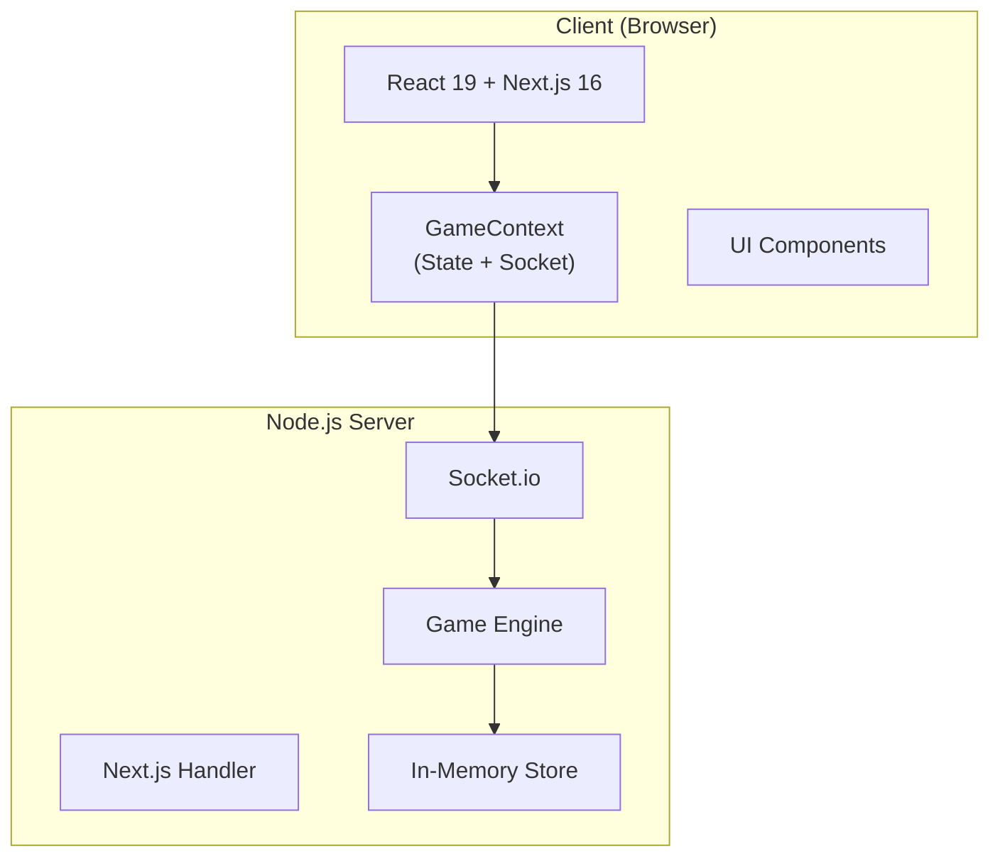

# Loto Game Architecture

This document describes the architecture and key design decisions of the Loto multiplayer game.

## Overview



## Directory Structure

```
src/
├── app/                 # Next.js App Router pages
├── components/          # React components
│   ├── common/          # Reusable primitives (Button, Modal, Skeleton)
│   └── ...              # Feature components
├── engine/              # Pure game logic (no side effects)
├── hooks/               # Custom React hooks
├── lib/                 # Shared utilities
│   ├── types.ts         # TypeScript definitions
│   ├── constants.ts     # Game configuration
│   └── GameContext.tsx  # Socket + state management
├── server/              # Server-side handlers
│   ├── handlers/        # Socket event handlers
│   └── store.ts         # In-memory game storage
└── styles/              # CSS design system
```

## Key Design Principles

### 1. Immutable State
All game engine functions return new state objects:
```typescript
function callNextNumber(state: GameState): GameState {
    const [nextNumber, ...remaining] = state.remainingNumbers;
    return {
        ...state,
        currentNumber: nextNumber,
        remainingNumbers: remaining,
    };
}
```

### 2. Separation of Concerns
- **Engine**: Pure functions for game logic (no I/O)
- **Handlers**: Socket event orchestration
- **Store**: Simple Map-based storage
- **Components**: Presentation and user interaction

### 3. Type Safety
Branded types and strict TypeScript prevent common errors:
```typescript
export type GamePhase = 'lobby' | 'playing' | 'paused' | 'finished';
export type SabotageType = 'snowball' | 'ink_splat' | 'swap_hand';
```

## Socket Events

### Client → Server
| Event | Description |
|-------|-------------|
| `room:create` | Create new game room |
| `room:join` | Join existing room |
| `game:start` | Host starts game |
| `game:callNumber` | Host calls next number |
| `game:markCell` | Player marks a cell |
| `game:claimWin` | Player claims victory |

### Server → Client
| Event | Description |
|-------|-------------|
| `game:state` | Full state sync |
| `game:numberCalled` | New number announced |
| `game:winner` | Winner declared |
| `game:error` | Error message |

## Performance Optimizations

1. **Memoization**: Components use `useMemo` and `React.memo`
2. **Set Lookups**: Called numbers converted to Set for O(1) checks
3. **Code Splitting**: Dynamic imports for heavy components
4. **Prefetching**: Next screens preloaded based on game phase

## Testing Strategy

- **Unit Tests**: Game engine pure functions (`vitest`)
- **Integration Tests**: Handler logic with mocked IO
- **Manual**: Full gameplay flow testing

Run tests:
```bash
npm test
```
